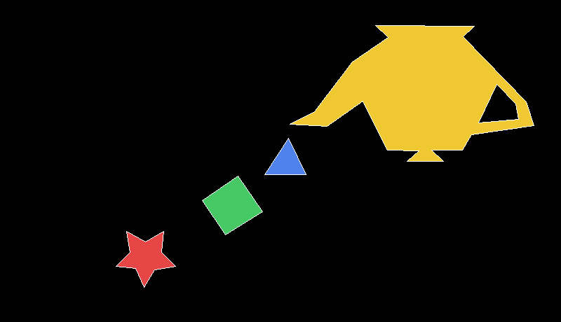

# Laboratorio 1 — Relleno de Polígonos

**Curso:** Gráficas por Computadora

**Nombre:** Javier Alvarado

**Carnet:** 24546

---

## Descripción

Este laboratorio implementa el **relleno de polígonos** sobre un framebuffer en
memoria, exportando el resultado final a imagen. Los algoritmos de dibujo de
líneas y de relleno se implementaron manualmente. La biblioteca `raylib` se
utiliza únicamente como framebuffer (una `Image` en memoria) y para exportar la
imagen resultante.

## Estructura del proyecto

El código se encuentra en la carpeta [`filling-any-polygon`](filling-any-polygon):

| Archivo | Descripción |
|---------|-------------|
| `src/main.rs` | Código fuente con toda la lógica del laboratorio. |
| `out.png` / `out.bmp` | Imágenes generadas por el programa. |
| `Cargo.toml` | Definición del paquete y sus dependencias. |

## Algoritmos implementados

- **Algoritmo de Bresenham** (`draw_line`): traza líneas rectas utilizando
  únicamente aritmética entera. Se emplea para dibujar el contorno de cada
  polígono.
- **Relleno por scanline con regla par-impar** (`fill_polygon`): rellena los
  polígonos línea horizontal por línea horizontal. Es compatible con polígonos
  cóncavos, de múltiples vértices e incluso con agujeros: al recibir varios
  contornos, el primero corresponde al borde exterior y los siguientes se
  interpretan como agujeros que permanecen sin rellenar de forma automática.

## Polígonos dibujados

| # | Descripción | Color de relleno |
|---|-------------|------------------|
| 1 | Estrella / figura cóncava (10 vértices) | Rojo |
| 2 | Cuadrilátero | Verde |
| 3 | Triángulo | Azul |
| 4 | Figura grande (18 vértices) con un agujero | Amarillo |
| 5 | Agujero dentro del polígono 4 (no se rellena) | — |

El fondo es negro y todos los contornos se dibujan en color blanco sobre el
relleno.

## Requisitos

- [Rust](https://www.rust-lang.org/tools/install) (edición 2021) con `cargo`.
- Dependencias del sistema necesarias para compilar `raylib` (compilador de
  C/C++ y CMake).

## Ejecución

```bash
cd filling-any-polygon
cargo run
```

Al finalizar, el programa genera los archivos `out.png` y `out.bmp` en la carpeta
`filling-any-polygon` e imprime el siguiente mensaje en consola:

```
Listo: se generaron out.png y out.bmp
```

## Resultado


